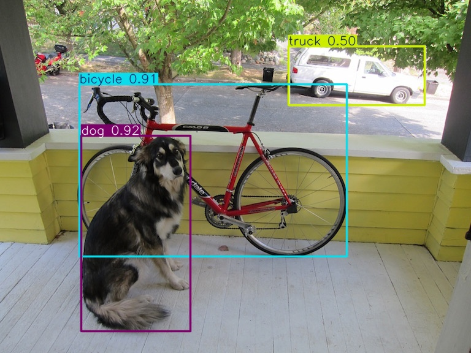

# YOLO Term Paper Implementation

This project demonstrates real-time object detection using YOLO models.

The implementation compares **YOLOv3 (existing system)** and **YOLOv11 (proposed system)** to analyze improvements in detection accuracy and speed.

## Technologies Used

* Python
* OpenCV
* Ultralytics YOLO
* Deep Learning

## Project Structure

```
YOLO_Term_Paper_Project
│
├── yolov11_detect.py
├── detect.py
├── coco.names
├── yolov3.cfg
└── images
    ├── dog.jpg
    └── output_yolo11.jpg
```

## Example Output

The model detects multiple objects such as bicycle, dog, and vehicles using bounding boxes.



## How to Run the Project

1. Install required libraries

pip install ultralytics opencv-python

2. Run the detection script

python yolov11_detect.py

## GitHub Repository

Implementation source code:
https://github.com/JINIMOLKS/YOLO-Term-Paper

